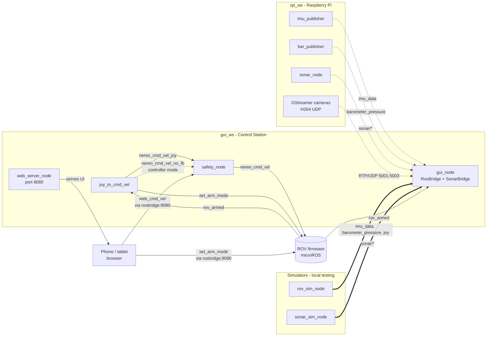

# Nereo PoliTOcean

The code for the ROV Nereo made by PoliTOcean.

The project is organized in two ROS 2 workspaces:
- `gui_ws`: control station (GUI + joystick command generation)
- `rpi_ws`: Raspberry Pi (sensor acquisition and publishing)

Current stack in the repo scripts is aligned to ROS 2 Humble.

## Installation (fresh machine)

### 0. Clone the repo

`nereo_interfaces` is a git submodule. Clone with:

```bash
git clone --recurse-submodules https://github.com/PoliTOcean/nereo_ros2_code.git
```

If you already cloned without `--recurse-submodules`:

```bash
git submodule update --init
```

### 1. Install rosbridge

```bash
sudo apt install ros-humble-rosbridge-suite
```

### 2. Register the custom rosdep sources

Some dependencies (`PyQt6`, `bluerobotics-ping`) are not in the default rosdep index.
Register the local override file once after cloning:

```bash
echo "yaml file://$(pwd)/rosdep.yaml" | sudo tee /etc/ros/rosdep/sources.list.d/nereo.list
rosdep update
```

### 3. Install all dependencies

```bash
# Control station (PC)
cd gui_ws
rosdep install --from-paths src --ignore-src -r -y

# Raspberry Pi
cd ../rpi_ws
rosdep install --from-paths src --ignore-src -r -y
```

> **Note:** `rosdep` covers most GUI dependencies automatically via the local `rosdep.yaml`.
> A few packages are not in the default rosdep index and must be installed manually.

#### Extra GUI dependencies (not covered by rosdep)

```bash
# GStreamer plugins (live camera streams in the GUI)
sudo apt install gstreamer1.0-plugins-good gstreamer1.0-plugins-base gstreamer1.0-tools

# tf_transformations (IMU orientation — not in pip/rosdep index)
sudo apt install ros-humble-tf-transformations

# PyQt6 with QML/QtQuick support (python3-pyqt6 apt package lacks QML bindings)
pip install PyQt6
```

| Dependency | Used by | Why not in rosdep |
|---|---|---|
| `gstreamer1.0-plugins-good/base` | `gui_pkg` | GStreamer apt split packages |
| `ros-humble-tf-transformations` | `gui_pkg` | ROS package, not a pip/apt rosdep key |
| `PyQt6` (pip) | `gui_pkg` | `python3-pyqt6` apt lacks `QtQml`/`QtQuick` bindings |

### 4. Build

```bash
cd gui_ws && colcon build && source install/setup.zsh
cd ../rpi_ws && colcon build && source install/setup.zsh
```

---

## ROS 2 packages

### `gui_ws` — Control station

1. **`gui_pkg`**
   - QML/QtQuick6 GUI with live video (3× GStreamer H264/UDP), IMU orientation widget, depth, sonar viewer.
   - `RosBridge`: subscribes to telemetry topics, exposes data to QML via PyQt6 signals.
   - `SonarBridge` + `SonarRenderer`: subscribes to sonar topics, renders waterfall and A-scan via matplotlib into `QQuickImageProvider`.
   - ROV connection status driven by `/rov_armed` heartbeat (published every firmware cycle).

2. **`joystick_pkg`**
   - Reads joystick input via `sensor_msgs/Joy` and publishes `CommandVelocity`.
   - Default mode: publishes on `/nereo_cmd_vel_joy` → forwarded by `safety_node`.
   - Controller mode (mode button toggle): publishes on `/nereo_cmd_vel_no_fb` → controller node → `safety_node`.
   - Arm button publishes on `/set_arm_mode`; arm state is tracked from `/rov_armed` feedback.
   - D-pad controls pitch/roll trim (incremental, rising-edge only).

3. **`web_pkg`**
   - HTTP server (port 8080) serving the web controller UI.
   - `safety_node`: arbitrates commands from physical controller and web interface, publishes on `/nereo_cmd_vel` with priority and timeout rules.
   - Web controller available at `http://<workstation-ip>:8080`.
   - ROV simulator available at `http://<workstation-ip>:8080/sim.html`.

### `rpi_ws` — Raspberry Pi

1. **`nereo_sensors_pkg`**
   - C++ nodes for IMU (WT61P over I2C) and barometer (MS5837 over I2C).

2. **`sonar_pkg`**
   - Python driver node for the Blue Robotics Ping1D altimeter/echosounder.
   - Serial connection via USB (or socat tunnel over Ethernet from the Raspberry Pi).
   - All sonar parameters (port, baud, speed of sound, scan range, gain, ping interval) are ROS 2 parameters.

## ROS 2 node map

### Nodes and responsibilities

| Node | Package | Side | Role |
| --- | --- | --- | --- |
| `imu_publisher` | `nereo_sensors_pkg` | RPi | Reads WT61P IMU over I2C, publishes data + diagnostics |
| `bar_publisher` | `nereo_sensors_pkg` | RPi | Reads MS5837 barometer over I2C, publishes pressure + diagnostics |
| `sonar_node` | `sonar_pkg` | RPi | Reads Ping1D via serial, publishes distance, confidence, profile |
| `gui_node` | `gui_pkg` | PC | Main QML dashboard, fuses all telemetry into the GUI |
| `joy_to_cmd_vel` | `joystick_pkg` | PC | Joystick → `CommandVelocity` on `_joy` or `_no_fb` topic |
| `safety_node` | `web_pkg` | PC | Arbitrates controller + web commands → `/nereo_cmd_vel` |
| `web_server_node` | `web_pkg` | PC | Serves web controller UI on port 8080 |
| `rov_sim_node` | `gui_pkg` | PC | Full ROV simulator for local testing |
| `sonar_sim_node` | `sonar_pkg` | PC | Sonar simulator publishing synthetic waterfall data |

### Topic map

| Publisher | Topic | Type | Consumer |
| --- | --- | --- | --- |
| `imu_publisher` | `imu_data` | `sensor_msgs/Imu` | `gui_node` |
| `imu_publisher` | `imu_diagnostic` | `diagnostic_msgs/DiagnosticArray` | — |
| `bar_publisher` | `barometer_pressure` | `sensor_msgs/FluidPressure` | `gui_node` |
| `bar_publisher` | `barometer_temperature` | `sensor_msgs/Temperature` | — |
| `bar_publisher` | `barometer_diagnostic` | `diagnostic_msgs/DiagnosticArray` | — |
| `sonar_node` / `sonar_sim_node` | `sonar/distance` | `std_msgs/Float32` | `gui_node` |
| `sonar_node` / `sonar_sim_node` | `sonar/confidence` | `std_msgs/Int32` | `gui_node` |
| `sonar_node` / `sonar_sim_node` | `sonar/profile` | `std_msgs/Float32MultiArray` | `gui_node` |
| `joy_to_cmd_vel` | `/nereo_cmd_vel_joy` | `nereo_interfaces/CommandVelocity` | `safety_node` |
| `joy_to_cmd_vel` | `/nereo_cmd_vel_no_fb` | `nereo_interfaces/CommandVelocity` | controller node / `safety_node` |
| `joy_to_cmd_vel` | `/joy_control_active` | `std_msgs/Bool` | `gui_node`, web |
| `joy_to_cmd_vel` / web client | `/set_arm_mode` | `std_msgs/Bool` | **ROV firmware** |
| web client | `/web_cmd_vel` | `nereo_interfaces/CommandVelocity` | `safety_node` |
| `safety_node` | `/nereo_cmd_vel` | `nereo_interfaces/CommandVelocity` | **ROV firmware** |
| **ROV firmware** | `/rov_armed` | `std_msgs/Bool` | `gui_node`, `joy_to_cmd_vel`, web |
| **ROV firmware** | `/thruster_status` | `nereo_interfaces/ThrusterStatuses` | — |

### Safety arbitration rules (`safety_node`)

| Condition | Output |
| --- | --- |
| Controller active (message < 0.5 s ago) | Controller command forwarded, web ignored |
| Only web active | Web command forwarded |
| Web silent for 0–1 s | Last web command held |
| Web silent for 1–1.5 s | Command ramped to zero |
| Web silent > 1.5 s | Zero command sent |
| No source active | Zero command sent |

### Mermaid diagram — workspace architecture



## Running on the workstation (with ROV)

A single launch file starts everything: joystick driver, command translator, GUI, safety arbiter, rosbridge WebSocket, and web controller server.

```bash
source gui_ws/install/setup.zsh
ros2 launch gui_pkg workstation.launch.py
```

Optional arguments:

```bash
# DS5 (different button indices)
ros2 launch gui_pkg workstation.launch.py btn_arm:=10 btn_mode:=8

# Different joystick device
ros2 launch gui_pkg workstation.launch.py device:=/dev/input/js1
```

### Physical controller mapping

| Input | Action | Xbox One S (default) | DS5 |
| --- | --- | --- | --- |
| Left stick Y/X | Surge / Sway | — | — |
| Right stick Y/X | Heave / Yaw | — | — |
| D-pad up/down | Pitch trim | — | — |
| D-pad left/right | Roll trim | — | — |
| Arm/Disarm | Toggle arm | Xbox (btn 8) | PS (btn 10) |
| Mode toggle | Direct ↔ Controller | View (btn 6) | Share (btn 8) |

**Direct mode** (👮 red in GUI): commands go to `/nereo_cmd_vel_joy` → `safety_node` → ROV.

**Controller mode** (👮 blue in GUI): commands go to `/nereo_cmd_vel_no_fb` → controller node → `safety_node` → ROV.

### Web controller (phone / tablet)

Find the workstation IP:
```bash
hostname -I | awk '{print $1}'
```

Open from any device on the same network:
- **Controller**: `http://<IP>:8080`
- **ROV simulator**: `http://<IP>:8080/sim.html`

The web controller publishes on `/web_cmd_vel`. The `safety_node` gives priority to the physical controller when both are active.

---

## Local testing (without ROV hardware)

### 1. Build both workspaces

```bash
cd gui_ws && colcon build && source install/setup.zsh
cd ../rpi_ws && colcon build && source install/setup.zsh
```

### 2. Launch the full simulator (Terminal 1)

```bash
# IMU + barometer + joystick + arm topic + 3 GStreamer test cameras
ros2 run gui_pkg rov_sim_node

# Disable cameras if GStreamer is not available
ros2 run gui_pkg rov_sim_node --ros-args -p simulate_cameras:=false
```

### 3. Launch the sonar simulator (Terminal 2)

```bash
ros2 run sonar_pkg sonar_sim_node
```

Simulates a sinusoidally oscillating bottom (2–8 m), gaussian echo profile, and a periodic confidence drop to test the threshold filter in the Sonar Viewer.

### 4. Launch workstation stack (Terminal 3)

```bash
ros2 launch gui_pkg workstation.launch.py
```

Open the **SONAR** button to see the live waterfall and A-scan. Open `http://localhost:8080` for the web controller and `http://localhost:8080/sim.html` for the top-down ROV simulator.

### Manual test scripts

- `gui_ws/src/gui_pkg/test/cam_test.sh` — launches 3 GStreamer test streams independently.
- `ros2 run joystick_pkg rov_cmd_monitor` — terminal dashboard showing live 6-DOF command vector.

---

### Unit test usage

Inside `unit_tests`, you can find subdirectories containing CMake projects used to run simple debugging tests on stdout.

#### Unit test setup instructions

1. Move into a specific test folder, for example `unit_tests/my_unit_test`.
2. Configure and build:
    ```
    cmake .
    make
    ```
3. Run the produced executable (same name as the folder):
   ```
   ./my_unit_test
   ```
