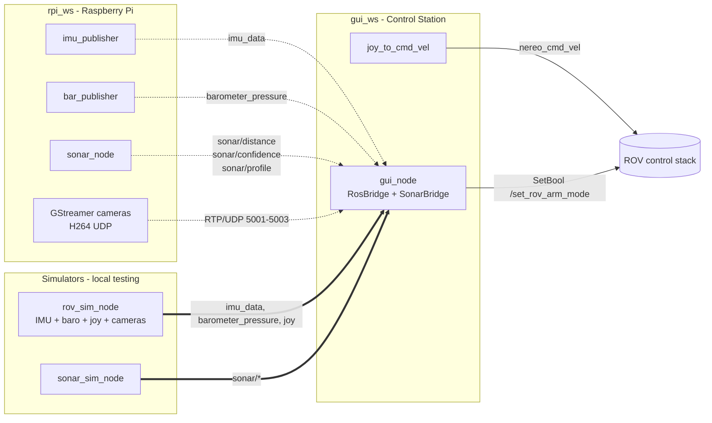

# Nereo PoliTOcean

The code for the ROV Nereo made by PoliTOcean.

The project is organized in two ROS 2 workspaces:
- `gui_ws`: control station (GUI + joystick command generation)
- `rpi_ws`: Raspberry Pi (sensor acquisition and publishing)

Current stack in the repo scripts is aligned to ROS 2 Humble.

## Installation (fresh machine)

### 1. Register the custom rosdep sources

Some dependencies (`PyQt6`, `bluerobotics-ping`) are not in the default rosdep index.
Register the local override file once after cloning:

```bash
echo "yaml file://$(pwd)/rosdep.yaml" | sudo tee /etc/ros/rosdep/sources.list.d/nereo.list
rosdep update
```

### 2. Install all dependencies

```bash
# Control station (PC)
cd gui_ws
rosdep install --from-paths src --ignore-src -r -y

# Raspberry Pi
cd ../rpi_ws
rosdep install --from-paths src --ignore-src -r -y
```

### 3. Build

```bash
cd gui_ws && colcon build && source install/setup.zsh
cd ../rpi_ws && colcon build && source install/setup.zsh
```

---

## ROS 2 packages

### `gui_ws` — Control station

1. **`gui_pkg`**
   - QML/QtQuick6 GUI with live video (3× GStreamer H264/UDP), IMU orientation widget, depth, sonar viewer.
   - `RosBridge`: subscribes to telemetry topics, exposes data to QML via PyQt6 signals.
   - `SonarBridge` + `SonarRenderer`: subscribes to sonar topics, renders waterfall and A-scan via matplotlib into `QQuickImageProvider`.
   - Dispatches async `/set_rov_arm_mode` service calls with thread-safe Qt signal delivery.

2. **`joystick_pkg`**
   - Reads joystick input and publishes `CommandVelocity` on `/nereo_cmd_vel`.

### `rpi_ws` — Raspberry Pi

1. **`nereo_sensors_pkg`**
   - C++ nodes for IMU (WT61P over I2C) and barometer (MS5837 over I2C).

2. **`sonar_pkg`**
   - Python driver node for the Blue Robotics Ping1D altimeter/echosounder.
   - Serial connection via USB (or socat tunnel over Ethernet from the Raspberry Pi).
   - All sonar parameters (port, baud, speed of sound, scan range, gain, ping interval) are ROS 2 parameters.

## ROS 2 node map

### Nodes and responsibilities

| Node | Package | Side | Role |
| --- | --- | --- | --- |
| `imu_publisher` | `nereo_sensors_pkg` | RPi | Reads WT61P IMU over I2C, publishes data + diagnostics |
| `bar_publisher` | `nereo_sensors_pkg` | RPi | Reads MS5837 barometer over I2C, publishes pressure + diagnostics |
| `sonar_node` | `sonar_pkg` | RPi | Reads Ping1D via serial, publishes distance, confidence, profile |
| `gui_node` | `gui_pkg` | PC | Main QML dashboard, fuses all telemetry into the GUI |
| `joy_to_cmd_vel` | `joystick_pkg` | PC | Joystick → `CommandVelocity` |
| `rov_sim_node` | `gui_pkg` | PC | Full ROV simulator for local testing (see below) |
| `sonar_sim_node` | `sonar_pkg` | PC | Sonar simulator publishing synthetic waterfall data |

### Published topics

| Node | Topic | Type |
| --- | --- | --- |
| `imu_publisher` | `imu_data` | `sensor_msgs/Imu` |
| `imu_publisher` | `imu_diagnostic` | `diagnostic_msgs/DiagnosticArray` |
| `bar_publisher` | `barometer_pressure` | `sensor_msgs/FluidPressure` |
| `bar_publisher` | `barometer_temperature` | `sensor_msgs/Temperature` |
| `bar_publisher` | `barometer_diagnostic` | `diagnostic_msgs/DiagnosticArray` |
| `sonar_node` / `sonar_sim_node` | `sonar/distance` | `std_msgs/Float32` |
| `sonar_node` / `sonar_sim_node` | `sonar/confidence` | `std_msgs/Int32` |
| `sonar_node` / `sonar_sim_node` | `sonar/profile` | `std_msgs/Float32MultiArray` |
| `joy_to_cmd_vel` | `/nereo_cmd_vel` | `nereo_interfaces/CommandVelocity` |
| `rov_sim_node` | `imu_data`, `barometer_pressure`, `joy` | (same as real nodes) |

### Mermaid diagram — workspace architecture



## Local testing (without ROV hardware)

A single command launches the full ROV simulator: IMU, barometer, joystick heartbeat, arm/disarm service, and 3 GStreamer test video streams.

### 1. Build both workspaces

```bash
cd nereo_ros2_code/gui_ws && colcon build && source install/setup.zsh
cd ../rpi_ws && colcon build && source install/setup.zsh
```

### 2. Launch the full simulator (Terminal 1)

```bash
# IMU + barometer + joystick + arm service + 3 GStreamer test cameras
ros2 run gui_pkg rov_sim_node

# Disable cameras if GStreamer is not available
ros2 run gui_pkg rov_sim_node --ros-args -p simulate_cameras:=false
```

### 3. Launch the sonar simulator (Terminal 2)

```bash
ros2 run sonar_pkg sonar_sim_node
```

Simulates a sinusoidally oscillating bottom (2–8 m), gaussian echo profile, and a periodic confidence drop to test the threshold filter in the Sonar Viewer.

### 4. Launch the GUI (Terminal 3)

```bash
ros2 run gui_pkg gui_node
```

Open the **SONAR** button to see the live waterfall and A-scan. The **Control Panel** arm button and joystick/ROV connection badges are all functional via the simulator.

### Manual test scripts

- `gui_ws/src/gui_pkg/test/cam_test.sh` — standalone script to launch the 3 GStreamer test streams independently (useful to test video boxes in isolation).

---

### Unit test usage

Inside `unit_tests`, you can find subdirectories containing CMake projects used to run simple debugging tests on stdout.

#### Unit test setup instructions

1. Move into a specific test folder, for example `unit_tests/my_unit_test`.
2. Configure and build:

   ```bash
   cmake .
   make
   ```
3. Run the produced executable (same name as the folder):

   ```bash
   ./my_unit_test
   ```
