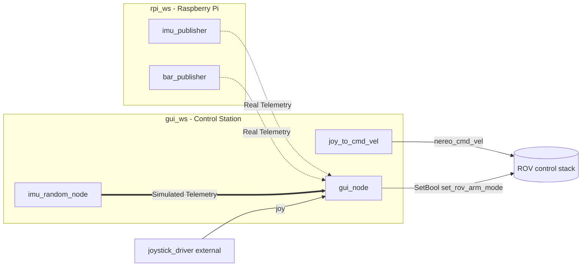

# Nereo PoliTOcean

The code for the ROV Nereo made by PoliTOcean.

The project is organized in two ROS 2 workspaces:
- `gui_ws`: control station (GUI + joystick command generation)
- `rpi_ws`: Raspberry Pi (sensor acquisition and publishing)

Current stack in the repo scripts is aligned to ROS 2 Jazzy.

## ROS 2 packages

1. `gui_pkg`
    - QML-based GUI node and diagnostics visualization.
    - Subscribes to sensor/diagnostic topics and triggers arm/disarm service via an integrated asynchronous bridge.
    - Includes a built-in telemetry simulator for testing purposes.

2. `joystick_pkg`
    - Reads joystick data and publishes vehicle command velocity.

3. `nereo_sensors_pkg` (in `rpi_ws`)
    - C++ nodes for IMU and barometer over I2C on Raspberry Pi.

## ROS 2 node map

### Nodes and responsibilities

- `imu_publisher` (`rpi_ws/src/nereo_sensors_pkg/src/imuPub.cpp`)
   - Publishes IMU data and IMU diagnostics.
- `bar_publisher` (`rpi_ws/src/nereo_sensors_pkg/src/barPub.cpp`)
   - Publishes pressure, temperature, and barometer diagnostics.
- `joy_to_cmd_vel` (`gui_ws/src/joystick_pkg/joystick_pkg/joy_to_cmdvel.py`)
   - Reads joystick and publishes `CommandVelocity` on `/nereo_cmd_vel`.
- `gui_node` (`gui_ws/src/gui_pkg/gui_pkg/gui_node.py`)
   - Main control station interface. Fuses ROS 2 topics with the QtQuick/QML engine and acts as a client for `/set_rov_arm_mode`.
- `imu_random_node` (`gui_ws/src/gui_pkg/gui_pkg/simple_publisher_imu_node.py`)
   - **Simulation utility**. Generates and publishes dynamic dummy data for both IMU and Barometer to test the interface locally.

### Detailed behavior: what each node does and where

#### 1) `imu_publisher` (Raspberry Pi side)
- **Where**: `rpi_ws/src/nereo_sensors_pkg/src/imuPub.cpp`
- **Node name**: `imu_publisher`
- **Main responsibility**:
   - Reads IMU measurements from hardware (angular velocity, linear acceleration, orientation).
   - Converts orientation to quaternion.
   - Computes covariance matrices from sliding windows.
   - Publishes both sensor data and diagnostics.
- **Published topics**:
   - `imu_data` (`sensor_msgs/msg/Imu`)
   - `imu_diagnostic` (`diagnostic_msgs/msg/DiagnosticArray`)
- **Execution model**:
   - Timer callback every ~200 ms (`create_wall_timer(200ms, ...)`).

#### 2) `bar_publisher` (Raspberry Pi side)
- **Where**: `rpi_ws/src/nereo_sensors_pkg/src/barPub.cpp`
- **Node name**: `bar_publisher`
- **Main responsibility**:
   - Reads barometer values (temperature + pressure) from I2C sensor.
   - Builds and publishes a diagnostic report depending on acquisition/init status.
- **Published topics**:
   - `barometer_temperature` (`sensor_msgs/msg/Temperature`)
   - `barometer_pressure` (`sensor_msgs/msg/FluidPressure`)
   - `barometer_diagnostic` (`diagnostic_msgs/msg/DiagnosticArray`)
- **Execution model**:
   - Timer callback every ~300 ms (`create_wall_timer(300ms, ...)`).

#### 3) `joy_to_cmd_vel` (Control station side)
- **Where**: `gui_ws/src/joystick_pkg/joystick_pkg/joy_to_cmdvel.py`
- **Node name**: `joy_to_cmd_vel`
- **Main responsibility**:
   - Reads joystick state through the local controller abstraction.
   - Applies deadzone and cooldown logic for pitch/roll accumulation.
   - Builds and publishes vehicle command vector.
- **Published topics**:
   - `/nereo_cmd_vel` (`nereo_interfaces/msg/CommandVelocity`)
- **Execution model**:
   - Timer callback at 20 Hz (`create_timer(1/20, ...)`).

#### 4) `gui_node` (Control station side)
- **Where**: `gui_ws/src/gui_pkg/gui_pkg/gui_node.py`
- **Node name**: `gui_node`
- **Main responsibility**:
   - Subscribes to sensor/diagnostic/joystick topics.
   - Bridges telemetry data directly into the QML context property layer (`RosBridge`).
   - Tracks joystick link health with a periodic 1-second timeout connection check.
   - Intercepts joystick buttons and GUI events to dispatch asynchronous `/set_rov_arm_mode` service calls.
- **Subscribed topics**:
   - `imu_data` (`sensor_msgs/msg/Imu`)
   - `barometer_pressure` (`sensor_msgs/msg/FluidPressure`)
   - `joy` (`sensor_msgs/msg/Joy`)
- **Execution model**:
   - Non-blocking execution running on the Qt event thread. Telemetry updates are synchronized natively using a high-frequency `QTimer` invoking `rclpy.spin_once()`.

#### 5) `imu_random_node` (Control station side - Simulation)
- **Where**: `gui_ws/src/gui_pkg/gui_pkg/simple_publisher_imu_node.py`
- **Node name**: `sensors_random_node`
- **Main responsibility**:
   - Built-in GUI simulator tool.
   - Generates synthetic continuous sinusoidal movements converting Euler angles into native quaternions to simulate ROV pitch, roll, and yaw waves.
   - Simulates depth variations around a 5-meter midpoint by calculating the equivalent inverted Pascal fluid pressure.
- **Published topics**:
   - `imu_data` (`sensor_msgs/msg/Imu`)
   - `barometer_pressure` (`sensor_msgs/msg/FluidPressure`)
- **Execution model**:
   - Periodic wall timer running at 10 Hz.

### Publisher / Subscriber matrix

| Node | Publishers | Subscribers | Services |
|---|---|---|---|
| `imu_publisher` | `imu_data`, `imu_diagnostic` | - | - |
| `bar_publisher` | `barometer_temperature`, `barometer_pressure`, `barometer_diagnostic` | - | - |
| `joy_to_cmd_vel` | `/nereo_cmd_vel` | - | - |
| `gui_node` | - | `imu_data`, `barometer_pressure`, `joy` | Client of `/set_rov_arm_mode` (`SetBool`) |
| `imu_random_node` | `imu_data`, `barometer_pressure` | - | - |

### Mermaid diagram - workspace architecture



### Local GUI testing (Without ROV Hardware)

You can spin up the full QML Dashboard and feed it simulated telemetry directly from your local machine using the built-in standalone simulator.

#### 1. Build the workspace
Ensure your packages are properly compiled using symlinks for easy frontend updates:

```bash
cd nereo_ros2_code/gui_ws
colcon build --symlink-install
source install/setup.zsh
```

#### 2. Launch the QML Dashboard
Start the primary user interface node. The multi-camera GStreamer engines will safely load blank pitch-black fallbacks if video streams are offline:

```bash
ros2 run gui_pkg gui_node
```

#### 3. Run the telemetry simulator
In a separate terminal, trigger the ununified random node to inject dynamic spatial data:

```bash
source install/setup.zsh
ros2 run gui_pkg imu_random_node
```

The QML compass and 2D widgets will immediately reflect realistic continuous pitch/roll rotations, and the **DEPTH** readout will autonomously fluctuate to confirm operational parsing.

#### 4. Mocking the ARM service
To test button behaviors inside the **Control Panel** window without an active physical ROV server, you can command terminal-based feedback:

```bash
ros2 service reply /set_rov_arm_mode std_srvs/srv/SetBool "{success: true, message: 'Simulated feedback success'}"
```

### Local GUI testing (simpler)

Run `check_controls.py` to check rov and joystick connection badges, arm status and telemetry.
Run `cam_test.sh` to start 3 video streams to check if the videoBox work

---

### Unit test usage

Inside `unit_tests`, you can find subdirectories containing CMake projects used to run simple debugging tests on stdout.

#### Unit test setup instructions

1. Move into a specific test folder, for example `unit_tests/my_unit_test`.
2. Configure and build:
    ```
    cmake .
    make
    ```
3. Run the produced executable (same name as the folder):
   ```
   ./my_unit_test
   ```
