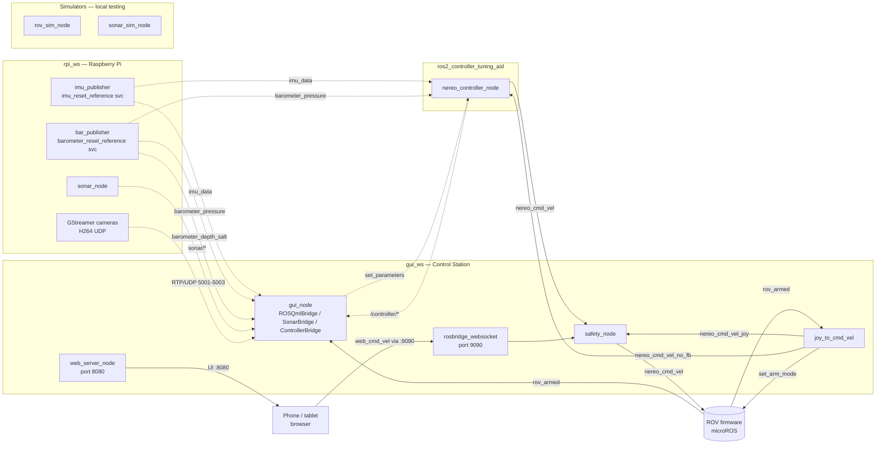

# Nereo PoliTOcean

Code for the **Nereo** ROV by PoliTOcean.

The project is split into two ROS 2 (Humble) workspaces:

| Workspace | Side | Purpose |
|---|---|---|
| `gui_ws` | Control station (PC) | GUI, joystick, web controller, safety arbitration |
| `rpi_ws` | Raspberry Pi (on the ROV) | IMU / barometer / sonar acquisition |

The **PID/state-space controller** lives in a separate repository, [`ros2_controller_tuning_aid`](https://github.com/PoliTOcean/ros2_controller_tuning_aid), and is wired in by the `workstation.launch.py` of `gui_pkg`.

---

## Table of contents

1. [Installation](#installation)
2. [Build](#build)
3. [Run](#run)
4. [Workspace structure](#workspace-structure)
5. [ROS 2 node and topic map](#ros-2-node-and-topic-map)
6. [GUI features](#gui-features)
7. [Web controller (phone / tablet)](#web-controller-phone--tablet)
8. [Local testing (no ROV hardware)](#local-testing-no-rov-hardware)
9. [Troubleshooting](#troubleshooting)

---

## Installation

### 0. Clone the repos

`nereo_interfaces` is a git submodule of this repo. Clone with `--recurse-submodules`:

```bash
git clone --recurse-submodules https://github.com/PoliTOcean/nereo_ros2_code.git
```

If already cloned without it:

```bash
git submodule update --init
```

Clone the controller repo **next to** this one (paths in `workstation.launch.py` assume they are siblings under `~/Documents/PoliTOcean/RD/`):

```bash
git clone https://github.com/PoliTOcean/ros2_controller_tuning_aid.git
```

### 1. System dependencies

```bash
sudo apt update
sudo apt install \
    ros-humble-rosbridge-suite \
    ros-humble-tf-transformations \
    gstreamer1.0-plugins-good gstreamer1.0-plugins-base gstreamer1.0-tools \
    python3-qrcode python3-pil
```

| Package | Used by | Why it's needed |
|---|---|---|
| `ros-humble-rosbridge-suite` | `web_pkg` | WebSocket bridge for the web controller (port 9090) |
| `ros-humble-tf-transformations` | `gui_pkg` | Quaternion → RPY conversion in the GUI |
| `gstreamer1.0-plugins-*` | `gui_pkg` | Live H.264/UDP video from the ROV cameras |
| `python3-qrcode`, `python3-pil` | `gui_pkg` | Generates the QR code shown on `Ctrl+Q` for the web controller URL |

### 2. PyQt6 with QML bindings (pip)

The apt `python3-pyqt6` package ships without `QtQml`/`QtQuick`. Install via pip:

```bash
pip install PyQt6
```

### 3. Register the custom rosdep sources

A few dependencies (`PyQt6`, `bluerobotics-ping`) are not in the default rosdep index. The local override sits at `rosdep.yaml` in this repo:

```bash
echo "yaml file://$(pwd)/rosdep.yaml" | sudo tee /etc/ros/rosdep/sources.list.d/nereo.list
rosdep update
```

### 4. Install per-package dependencies

```bash
# Control station (PC)
cd gui_ws
rosdep install --from-paths src --ignore-src -r -y

# Raspberry Pi
cd ../rpi_ws
rosdep install --from-paths src --ignore-src -r -y
```

---

## Build

```bash
# Controller (must be built first — gui_ws launch file pulls it in via AMENT_PREFIX_PATH)
cd ../ros2_controller_tuning_aid && colcon build && source install/setup.zsh

# Control station
cd ../nereo_ros2_code/gui_ws && colcon build && source install/setup.zsh

# Raspberry Pi
cd ../rpi_ws && colcon build && source install/setup.zsh
```

---

## Run

A single launch file starts everything on the workstation: joystick driver, command translator, GUI, safety arbiter, rosbridge WebSocket (port 9090), web controller server (port 8080), and the controller node.

```bash
ros2 launch gui_pkg workstation.launch.py
```

The launch file auto-prepends the `ros2_controller_tuning_aid` install dir to `AMENT_PREFIX_PATH`, so you do not need to source that overlay manually.

### Launch arguments

| Argument | Default | Description |
|---|---|---|
| `device` | `/dev/input/js0` | Joystick device path |
| `deadzone` | `0.05` | Joystick deadzone |
| `max_steps` | `10` | Quantization steps for axes |
| `btn_arm` | `8` | Arm/disarm button index |
| `btn_mode` | `6` | Direct ↔ Controller mode toggle button index |
| `control_mode` | `0` | Initial controller mode (0=passthrough, 1=PID, 2=PID-AW, 3=CS) |

### Physical controller mapping

| Input | Action | Xbox One S (default) | DS5 |
|---|---|---|---|
| Left stick Y/X | Surge / Sway | — | — |
| Right stick Y/X | Heave / Yaw | — | — |
| D-pad up/down | Pitch trim | — | — |
| D-pad left/right | Roll trim | — | — |
| Arm/Disarm | Toggle arm | Xbox (btn 8) | PS (btn 10) |
| Mode toggle | Direct ↔ Controller | View (btn 6) | Share (btn 8) |

Examples:

```bash
# DS5 button mapping
ros2 launch gui_pkg workstation.launch.py btn_arm:=10 btn_mode:=8

# Different joystick device
ros2 launch gui_pkg workstation.launch.py device:=/dev/input/js1
```

**Direct mode** (red lock icon in GUI): commands go to `/nereo_cmd_vel_joy` → `safety_node` → ROV.
**Controller mode** (blue lock icon in GUI): commands go to `/nereo_cmd_vel_no_fb` → controller node → `safety_node` → ROV.

---

## Workspace structure

```
nereo_ros2_code/
├── gui_ws/                          # Workstation workspace
│   └── src/
│       ├── gui_pkg/                 # QML/PyQt6 dashboard + joystick + rov simulator
│       │   ├── gui_pkg/
│       │   │   ├── gui_node.py      # Main node + ROSQmlBridge / SonarBridge / ControllerBridge
│       │   │   ├── rov_sim_node.py  # Full ROV simulator (IMU, barometer, cameras, joy)
│       │   │   └── qml/             # QML UI
│       │   │       ├── main.qml
│       │   │       └── components/
│       │   │           ├── ControllerTunerWindow.qml   # PID/CS tuning UI (deg/m setpoints)
│       │   │           ├── ControlPanelWindow.qml
│       │   │           ├── SonarWindow.qml
│       │   │           ├── Orientation2D.qml
│       │   │           └── VideoBox.qml
│       │   └── launch/
│       │       └── workstation.launch.py
│       ├── joystick_pkg/            # joy → CommandVelocity
│       ├── web_pkg/
│       │   ├── web_server_node.py   # HTTP server on :8080
│       │   ├── safety_node.py       # Arbitrates physical vs. web commands
│       │   └── static/              # Web controller UI assets
│       └── nereo_interfaces/        # CommandVelocity, ThrusterStatuses (submodule)
└── rpi_ws/                          # Raspberry Pi workspace
    └── src/
        ├── nereo_sensors_pkg/       # C++ — IMU (WT61P) + barometer (MS5837)
        │   ├── src/imuPub.cpp       # publishes /imu_data, service imu_reset_reference
        │   ├── src/barPub.cpp       # publishes /barometer_*, service barometer_reset_reference
        │   └── include/nereo_sensors_pkg/
        └── sonar_pkg/               # Python — Blue Robotics Ping1D
```

---

## ROS 2 node and topic map

### Nodes

| Node | Package | Side | Role |
|---|---|---|---|
| `imu_publisher` | `nereo_sensors_pkg` | RPi | WT61P over I2C → `/imu_data`; service `imu_reset_reference` |
| `bar_publisher` | `nereo_sensors_pkg` | RPi | MS5837 over I2C → `/barometer_*`; service `barometer_reset_reference` |
| `sonar_node` | `sonar_pkg` | RPi | Ping1D over serial → `/sonar/*` |
| `gui_node` | `gui_pkg` | PC | QML dashboard, telemetry fusion, QR code, tuner |
| `joy_to_cmd_vel` | `joystick_pkg` | PC | Joystick → `CommandVelocity` |
| `safety_node` | `web_pkg` | PC | Arbitrates controller + web commands → `/nereo_cmd_vel` |
| `web_server_node` | `web_pkg` | PC | Serves the web controller on `:8080` |
| `rosbridge_websocket` | `rosbridge_server` | PC | WebSocket bridge for the web client (`:9090`) |
| `nereo_controller_node` | `nereo_controller_node` | PC | PID / state-space controller (separate repo) |
| `rov_sim_node` | `gui_pkg` | PC | Local ROV simulator (no hardware needed) |
| `sonar_sim_node` | `sonar_pkg` | PC | Synthetic sonar data |

### Topics

| Publisher | Topic | Type | Consumers |
|---|---|---|---|
| `imu_publisher` | `imu_data` | `sensor_msgs/Imu` | `gui_node`, `nereo_controller_node` |
| `imu_publisher` | `imu_diagnostic` | `diagnostic_msgs/DiagnosticArray` | — |
| `bar_publisher` | `barometer_pressure` | `sensor_msgs/FluidPressure` | `gui_node`, `nereo_controller_node` |
| `bar_publisher` | `barometer_depth_salt` | `std_msgs/Float32` | `gui_node` (depth widget) |
| `bar_publisher` | `barometer_depth_fresh` | `std_msgs/Float32` | — |
| `bar_publisher` | `barometer_temperature` | `sensor_msgs/Temperature` | `gui_node` |
| `bar_publisher` | `barometer_diagnostic` | `diagnostic_msgs/DiagnosticArray` | — |
| `sonar_node` / `sonar_sim_node` | `sonar/distance` | `std_msgs/Float32` | `gui_node` |
| `sonar_node` / `sonar_sim_node` | `sonar/confidence` | `std_msgs/Int32` | `gui_node` |
| `sonar_node` / `sonar_sim_node` | `sonar/profile` | `std_msgs/Float32MultiArray` | `gui_node` |
| `joy_to_cmd_vel` | `/nereo_cmd_vel_joy` | `nereo_interfaces/CommandVelocity` | `safety_node` |
| `joy_to_cmd_vel` | `/nereo_cmd_vel_no_fb` | `nereo_interfaces/CommandVelocity` | `nereo_controller_node` |
| `joy_to_cmd_vel` | `/joy_control_active` | `std_msgs/Bool` | `gui_node`, web |
| `joy_to_cmd_vel` / web | `/set_arm_mode` | `std_msgs/Bool` | ROV firmware |
| `nereo_controller_node` | `/nereo_cmd_vel` (controller mode) | `nereo_interfaces/CommandVelocity` | `safety_node` |
| `nereo_controller_node` | `/controller/setpoints` | `std_msgs/Float64MultiArray` | tuner GUI |
| `nereo_controller_node` | `/controller/errors` | `std_msgs/Float64MultiArray` | tuner GUI |
| `nereo_controller_node` | `/controller/pid_terms` | `std_msgs/Float64MultiArray` | tuner GUI |
| web client | `/web_cmd_vel` | `nereo_interfaces/CommandVelocity` | `safety_node` |
| `safety_node` | `/nereo_cmd_vel` (direct mode) | `nereo_interfaces/CommandVelocity` | ROV firmware |
| ROV firmware | `/rov_armed` | `std_msgs/Bool` | `gui_node`, `joy_to_cmd_vel`, web |
| ROV firmware | `/thruster_status` | `nereo_interfaces/ThrusterStatuses` | — |

### Services

| Service | Type | Provider | Used by | Effect |
|---|---|---|---|---|
| `barometer_reset_reference` | `std_srvs/Trigger` | `bar_publisher` | GUI "ZERO" button | Re-zeroes the surface pressure → `depth = 0` at current spot |
| `imu_reset_reference` | `std_srvs/Trigger` | `imu_publisher` | GUI "ZERO RPY" button | Stores current orientation as offset → `roll/pitch/yaw = 0` at current attitude |

### Safety arbitration (`safety_node`)

| Condition | Output |
|---|---|
| Controller active (last msg < 0.5 s) | Controller command forwarded, web ignored |
| Only web active | Web command forwarded |
| Web silent 0–1 s | Last web command held |
| Web silent 1–1.5 s | Command ramped to zero |
| Web silent > 1.5 s | Zero command sent |
| No source active | Zero command sent |

### Architecture diagram



---

## GUI features

### Main dashboard
- 3× live H.264/UDP camera streams (main + 2 secondary)
- IMU orientation widget (yaw / pitch / roll)
- Depth, temperature, ROV arm/connection status
- **ZERO** button → re-zeroes depth at the surface (calls `barometer_reset_reference`)
- **ZERO RPY** button → re-zeroes attitude when the ROV is sitting level (calls `imu_reset_reference`)
- **Ctrl+Q** → opens a popup with a QR code + URL (`http://<ip>:8080`) for the web controller. The IP is recomputed every time the shortcut is pressed, so it works even if you connect to Wi-Fi after launching the GUI.

### Controller Tuner window (TUNER button)
- Selects control mode (0 passthrough / 1 PID / 2 PID anti-windup / 3 CS)
- Edits `kp/ki/kd` for depth/roll/pitch/yaw
- Manual setpoint toggles per axis
- **Setpoint inputs in display units**: depth in **metres**, roll/pitch/yaw in **degrees**.
  Conversion to controller units (Pa, rad) is done inside QML (density ρ = 1025 kg/m³, salt water — matches `barometer_depth_salt`). The controller-side parameters stay in their native units.
- Full CS controller section (kx, ki, heave/angle limits)
- Live telemetry: `/controller/setpoints`, `/controller/errors`, `/controller/pid_terms`

### Sonar Viewer (SONAR button)
Waterfall + A-scan rendered into a `QQuickImageProvider`, confidence threshold filter.

### Control Panel (CONTROL PANEL button)
Manual arming / mode toggles independent from the joystick.

---

## Web controller (phone / tablet)

Open from any device on the same network:
- **Controller**: `http://<workstation-ip>:8080`
- **ROV simulator**: `http://<workstation-ip>:8080/sim.html`

The fastest way to get the URL on a phone: focus the GUI and press **Ctrl+Q** — a QR code with the URL appears.

The web client publishes on `/web_cmd_vel`. `safety_node` gives priority to the physical controller when both are active.

> The `web_server_node` is robust to GUI shutdown: it installs a `SIGTERM` handler, closes the HTTP socket, and joins its serving thread on `destroy_node()`, so port 8080 is released cleanly and the launch file can be restarted without `pkill`.

---

## Local testing (no ROV hardware)

```bash
# Terminal 1 — full ROV simulator (IMU, barometer, joystick, arm, 3 GStreamer test streams)
ros2 run gui_pkg rov_sim_node
# (without GStreamer: --ros-args -p simulate_cameras:=false)

# Terminal 2 — sonar simulator
ros2 run sonar_pkg sonar_sim_node

# Terminal 3 — workstation stack
ros2 launch gui_pkg workstation.launch.py
```

Open `http://localhost:8080` for the web controller and `http://localhost:8080/sim.html` for the top-down ROV simulator.

### Manual test helpers
- `gui_ws/src/gui_pkg/test/cam_test.sh` — three independent GStreamer test streams
- `ros2 run joystick_pkg rov_cmd_monitor` — terminal dashboard of the live 6-DOF command vector

### Unit tests
Inside `unit_tests/` each subfolder is a CMake project for stdout-level debugging:

```bash
cd unit_tests/<name>
cmake . && make
./<name>
```

---

## Troubleshooting

| Symptom | Cause | Fix |
|---|---|---|
| `Address already in use :8080` at relaunch | Old `web_server_node` still running | Should not happen anymore (the node releases the socket on SIGTERM); if it does, `pkill -f web_server_node` |
| GUI starts but no `nereo_controller_node` | `ros2_controller_tuning_aid` not built or not at sibling path | Check `~/Documents/PoliTOcean/RD/ros2_controller_tuning_aid/install/` exists |
| `imu_reset_reference service not available` | `rpi_ws` not rebuilt after the new service was added | On the Pi: `colcon build --packages-select nereo_sensors_pkg` |
| Ctrl+Q shows "Nessuna rete" | No default-route interface up | Connect to Wi-Fi / Ethernet, press Ctrl+Q again (re-evaluated each time) |
| Ctrl+Q shows "Pacchetto python3-qrcode mancante" | Missing system package | `sudo apt install python3-qrcode python3-pil` |
| Tuner setpoint value looks wrong after RELOAD | Controller still has old unit value | The GUI now converts deg↔rad and m↔Pa; if you set parameters from CLI in raw units, RELOAD will display them converted |
