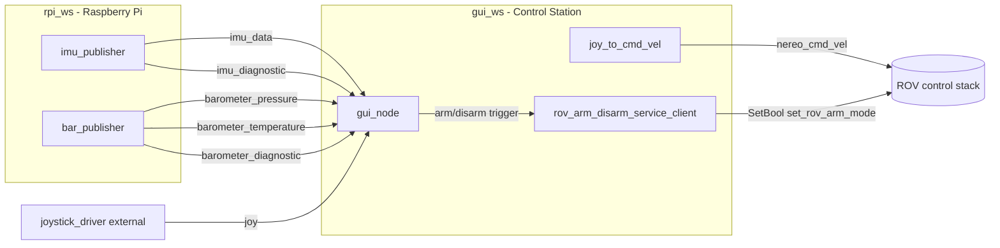
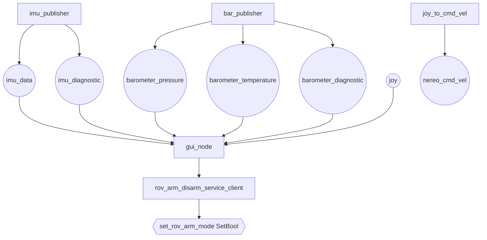

# Nereo PoliTOcean

The code for the ROV Nereo made by PoliTOcean.

The project is organized in two ROS 2 workspaces:
- `gui_ws`: control station (GUI + joystick command generation)
- `rpi_ws`: Raspberry Pi (sensor acquisition and publishing)

Current stack in the repo scripts is aligned to ROS 2 Jazzy.

## ROS 2 packages

1. `gui_pkg`
    - GUI node and diagnostics visualization.
    - Subscribes to sensor/diagnostic topics and triggers arm/disarm service.

2. `joystick_pkg`
    - Reads joystick data and publishes vehicle command velocity.

3. `nereo_sensors_pkg` (in `rpi_ws`)
    - C++ nodes for IMU and barometer over I2C on Raspberry Pi.

## ROS 2 node map

### Nodes and responsibilities

- `imu_publisher` (`rpi_ws/src/nereo_sensors_pkg/src/imuPub.cpp`)
   - Publishes IMU data and IMU diagnostics.
- `bar_publisher` (`rpi_ws/src/nereo_sensors_pkg/src/barPub.cpp`)
   - Publishes pressure, temperature, and barometer diagnostics.
- `joy_to_cmd_vel` (`gui_ws/src/joystick_pkg/joystick_pkg/joy_to_cmdvel.py`)
   - Reads joystick and publishes `CommandVelocity` on `/nereo_cmd_vel`.
- `gui_node` (`gui_ws/src/gui_pkg/gui_pkg/gui_node.py`)
   - Subscribes to sensor/diagnostic/joy topics to update UI and state.
- `rov_arm_disarm_service_client` (`gui_ws/src/gui_pkg/gui_pkg/Services.py`)
   - Service client for `/set_rov_arm_mode` (`std_srvs/srv/SetBool`).

### Detailed behavior: what each node does and where

#### 1) `imu_publisher` (Raspberry Pi side)
- **Where**: `rpi_ws/src/nereo_sensors_pkg/src/imuPub.cpp`
- **Node name**: `imu_publisher`
- **Main responsibility**:
   - Reads IMU measurements from hardware (angular velocity, linear acceleration, orientation).
   - Converts orientation to quaternion.
   - Computes covariance matrices from sliding windows.
   - Publishes both sensor data and diagnostics.
- **Published topics**:
   - `imu_data` (`sensor_msgs/msg/Imu`)
   - `imu_diagnostic` (`diagnostic_msgs/msg/DiagnosticArray`)
- **Execution model**:
   - Timer callback every ~200 ms (`create_wall_timer(200ms, ...)`).

#### 2) `bar_publisher` (Raspberry Pi side)
- **Where**: `rpi_ws/src/nereo_sensors_pkg/src/barPub.cpp`
- **Node name**: `bar_publisher`
- **Main responsibility**:
   - Reads barometer values (temperature + pressure) from I2C sensor.
   - Builds and publishes a diagnostic report depending on acquisition/init status.
- **Published topics**:
   - `barometer_temperature` (`sensor_msgs/msg/Temperature`)
   - `barometer_pressure` (`sensor_msgs/msg/FluidPressure`)
   - `barometer_diagnostic` (`diagnostic_msgs/msg/DiagnosticArray`)
- **Execution model**:
   - Timer callback every ~300 ms (`create_wall_timer(300ms, ...)`).

#### 3) `joy_to_cmd_vel` (Control station side)
- **Where**: `gui_ws/src/joystick_pkg/joystick_pkg/joy_to_cmdvel.py`
- **Node name**: `joy_to_cmd_vel`
- **Main responsibility**:
   - Reads joystick state through the local controller abstraction.
   - Applies deadzone and cooldown logic for pitch/roll accumulation.
   - Builds and publishes vehicle command vector.
- **Published topics**:
   - `/nereo_cmd_vel` (`nereo_interfaces/msg/CommandVelocity`)
- **Execution model**:
   - Timer callback at 20 Hz (`create_timer(1/20, ...)`).

#### 4) `gui_node` (Control station side)
- **Where**: `gui_ws/src/gui_pkg/gui_pkg/gui_node.py`
- **Node name**: `gui_node`
- **Main responsibility**:
   - Subscribes to sensor/diagnostic/joystick topics.
   - Feeds UI values (depth, roll/pitch/yaw) and peripheral diagnostic status.
   - Tracks joystick link health with a periodic connection check.
   - Triggers arm/disarm workflow through the service client.
- **Subscribed topics**:
   - `imu_data` (`sensor_msgs/msg/Imu`)
   - `barometer_pressure` (`sensor_msgs/msg/FluidPressure`)
   - `barometer_diagnostic` (`diagnostic_msgs/msg/DiagnosticArray`)
   - `imu_diagnostic` (`diagnostic_msgs/msg/DiagnosticArray`)
   - `diagnostic_messages` (`diagnostic_msgs/msg/DiagnosticArray`)
   - `joy` (`sensor_msgs/msg/Joy`)
- **Execution model**:
   - Runs inside a dedicated ROS thread in the GUI process.
   - Uses an internal queue + worker thread (`SensorProcessor`) to decouple UI updates.

#### 5) `rov_arm_disarm_service_client` (Control station side)
- **Where**: `gui_ws/src/gui_pkg/gui_pkg/Services.py`
- **Node name**: `rov_arm_disarm_service_client`
- **Main responsibility**:
   - Connects to `/set_rov_arm_mode` service (`SetBool`).
   - Handles reconnection retries and keeps local arm state.
   - Executes arm/disarm requests triggered by GUI/joystick events.

### Publisher / Subscriber matrix

| Node | Publishers | Subscribers | Services |
|---|---|---|---|
| `imu_publisher` | `imu_data` (`sensor_msgs/msg/Imu`), `imu_diagnostic` (`diagnostic_msgs/msg/DiagnosticArray`) | - | - |
| `bar_publisher` | `barometer_temperature` (`sensor_msgs/msg/Temperature`), `barometer_pressure` (`sensor_msgs/msg/FluidPressure`), `barometer_diagnostic` (`diagnostic_msgs/msg/DiagnosticArray`) | - | - |
| `joy_to_cmd_vel` | `/nereo_cmd_vel` (`nereo_interfaces/msg/CommandVelocity`) | - | - |
| `gui_node` | - | `imu_data`, `barometer_pressure`, `barometer_diagnostic`, `imu_diagnostic`, `diagnostic_messages`, `joy` | Uses `rov_arm_disarm_service_client` logic |
| `rov_arm_disarm_service_client` | - | - | Client of `/set_rov_arm_mode` (`SetBool`) |

### Mermaid diagram - workspace architecture



### Mermaid diagram - topic-centric view



## Unit test usage

Inside `unit_tests`, you can find subdirectories containing CMake projects used to run simple debugging tests on stdout.

### Unit test setup instructions

1. Move into a specific test folder, for example `unit_tests/my_unit_test`.
2. Configure and build:
    ```bash
    cmake .
    make
    ```
3. Run the produced executable (same name as the folder):
    ```bash
    ./my_unit_test
    ```
